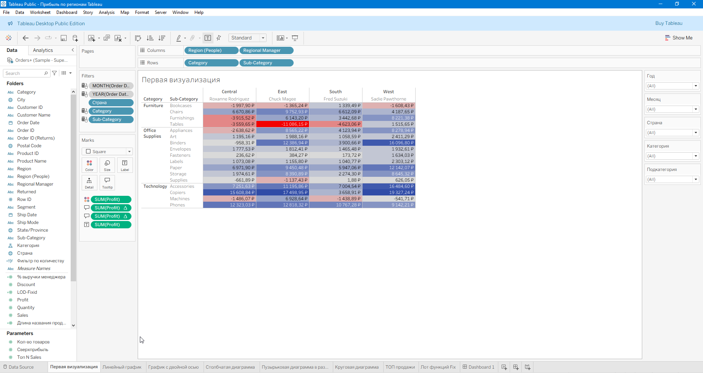
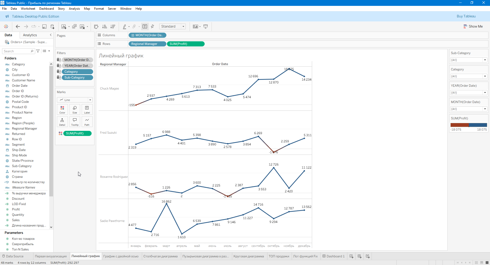
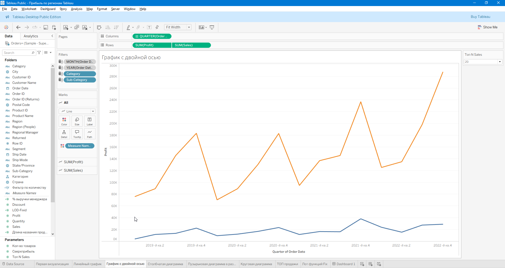
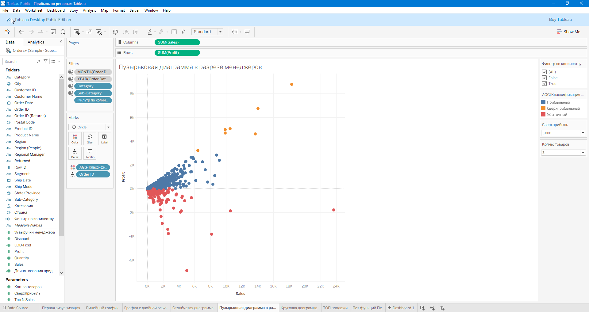
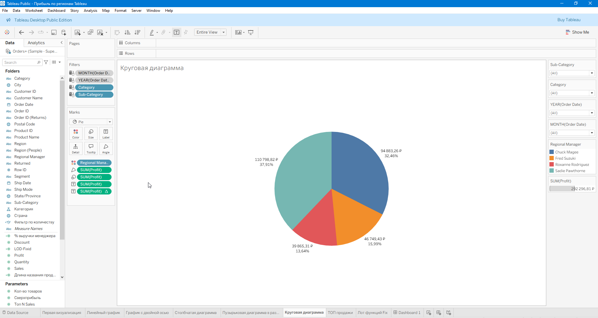
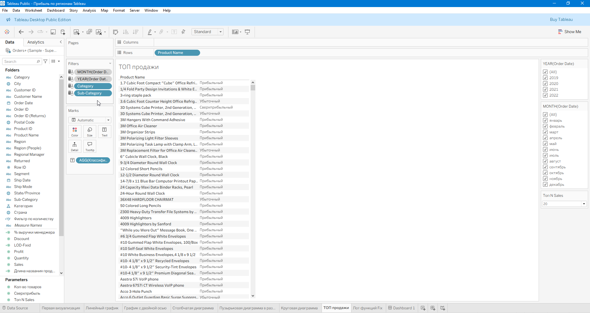
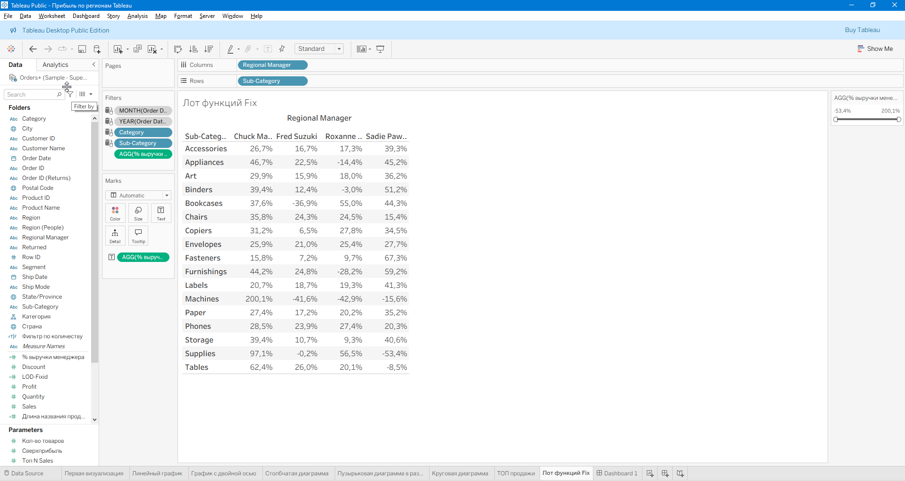

# tableau-sales-dashboard
📊 Описание
Интерактивный дашборд с визуализацией данных о продажах: 
- Анализ по категориям и регионам  
- Фильтры по времени   
- Графики динамики и KPI
  
Этот проект выполнен в **Tableau** по обучающему видео:  [📺 YouTube Tutorial](https://www.youtube.com/watch?v=fQcq8GpENyA&list=LL&index=77&t=8651s)

Моя онлайн-версия проекта:
Просмотреть в Tableau Public: [📺View on Tableau Public](https://public.tableau.com/app/profile/evgeniya.arzamastseva/viz/Tableau_17599865199150/Dashboard1?publish=yes)

🖼️ Скриншоты
Превью дашборда:

